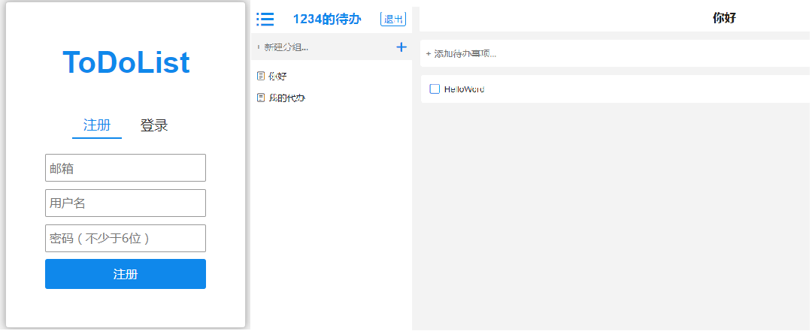
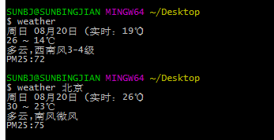

# 个人简历

- 姓名：孙兵见
- 年龄：22 
- 手机：18175388665
- Email：243281121@qq.com
- QQ：243281121
- 微信： Rising-sun2016

## 基本信息

 - 学历:本科 
 - 期望职位：前端工程师
 - 期望薪资：8k~12k
 - 期望城市：北京
 - 前端经验：1.5年
 - Github：https://github.com/Risingsbj
 - [个人博客](http://www.jianshu.com/u/0135bff4a7eb)

## 技能
- 熟练掌握HTML(5)、常用CSS(3)和常见的布局。具有 **平均水准之上** 的审美，追求设计的优雅。

- 熟练掌握原生Javascript，掌握重要概念如： **原型**， **闭包**， **作用域链**， **面向对象**， **异步流程控制**等。能够根据面向对象思想利用JS/jQuery **封装** 常用插件。 熟练使用 **ES6及ES7** 部分新特性。

- 熟悉React框架及相关流行库的使用，**理解重要概念**如：生命周期，异步更新，性能优化，虚拟DOM等。有 **相关项目踩坑（发现问题）脱坑（解决问题）**的经验。

- 熟悉**HTTP**协议及浏览器渲染原理，了解前端 **性能优化策略**。

- 熟悉**Yarn & Npm & Git** ，掌握Node.js，熟悉前后端数据交互的实现。

- 熟悉**CMD&AMD**机制，熟悉**Webpack**打包，优化手段。

- 追求**风格优雅**，**整洁**的代码。

## 个人项目

### My-FM 音乐播放器

- [在线预览](https://risingsbj.github.io/My-FM/)

- [Github源码](https://github.com/Risingsbj/My-FM)

- 项目简介：一个在线音乐播放器，利用开放音乐API，可在线播放音乐，进行播放、暂停、下一曲、调节音量、跳转播放进度等操作，还可以将当前音乐添加到本地的“喜爱音乐”列表，也可切换播放频道，在播放音乐时歌词根据播放进度自动滚动。

- 实现方式：运用原生JS，实现歌词滚动，单曲循环，下一首等功能；JQuery Ajax的Jsonp获取数据，根据接口数据将歌词的时间做间隔，歌词滚动；通过歌曲长度的百分比来对歌曲进行快进；歌曲时间转格式；原生CSS写基本样式,支持移动端。

- 涉及技术： 使用 HTML5、jQuery 实现 FM 应用，利用 Ajax 技术通过API请求数据。

--- 

### ToDoList-单页在线Todo应用

- [在线预览](https://risingsbj.github.io/react2/build/index.html)

- [Github源码](https://github.com/Risingsbj/react2)

- 项目简介：ToDoList是一个轻量级单页在线待办事项管理应用，支持注册，支持增删改查，云同步，视图切换，事项分类等功能。

- 实现方式：将组件逐一细分，尽量做到每一块都是一个独立的组建，方便日后修改，将状态放在顶层APP，通过props分发给子组件，通过state来管理数据状态，在渲染时，通过过滤筛选函数，把todoitem筛选然后渲染到页面；通过路由实现单页面的路由跳转，最后将账号密码部署到LeanCloud,并参考文档，增添邮箱找回密码。

- 涉及技术： 整个应用基于 React 框架和 LeanCloud搭建，用到了原生JavaScript和 ES6 等相关技术。

---

### 组件化商业首页

- [在线预览](https://risingsbj.github.io/requireJS-webpack-sample/webpack_sample/index.html)

- [Github源码](https://github.com/Risingsbj/requireJS-webpack-sample)

- 项目简介：这个项目是对组件封装以及代码打包的实践。
- 实现方式：组件包括轮播、Tab跟踪、AJAX封装、JSONP封装、无限加载、懒加载、回到顶部。由于涉及较多dom操作，选择使用jQuery提高开发效率。
- 整体页面使用webpack打包，也使用了requireJS作为对比，理解CMD&AMD差异。
- **查看更多封装组件和demo：** [我是链接](https://github.com/Risingsbj/Learning-box)。

---

### 一些 Node.js 小程序
##### weather-hunger

- [Github源码](https://github.com/Risingsbj/weather-hunger)

- [npm](https://www.npmjs.com/package/weather-hunger)

- 简单介绍： 它是一个实用的node命令行工具。

- 用npm全局安装后可以输入weather或weather+地名，查询用户当前所在城市的天气。

##### funny-robot

- [Github源码](https://github.com/Risingsbj/funny-robot)

- [npm](https://www.npmjs.com/package/funny-robot)

- 简单介绍： 一个有趣的聊天机器人。

- 使用nodejs官方readline模块和http模块进行命令行交互，结合 [图灵api](http://wap.tuling123.com/help/h_cent_webapi.jhtml?nav=doc)实现的一个有趣的机器人，发布到npm。

## 关于我
- **思维灵活发散**，**强大的自我驱动能力**。

- 在独立项目开发过程中体现出优秀的新技术学习、问题分析解决能力。 

- 寻找**技术驱动**，**成长空间良好**的团队，投入实践迅速提升自身技术素养的同时， 
为团队贡献可观的力量，成为**中流砥柱**，便是我的追求。

